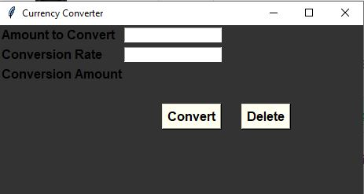

# CurrencyConverterPy
This is a mini python project that converts currency.

g

# How it works
In order to use this application, you will need to input the amount that you would like to convert and the currency rate. Once you add these values simply click convert! 

# Teach Used
I used Python for this project and tkinter module to create the GUI. 

# How to run app

In order to run this application, simple clone or download the repo and run it using you your preferred IDE. 
